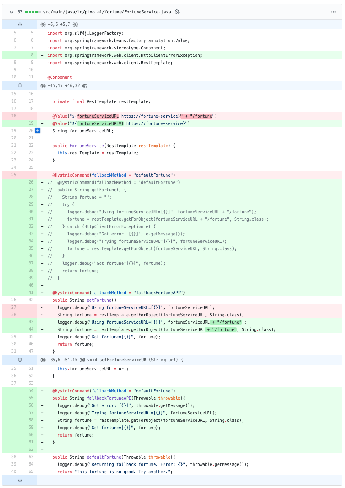
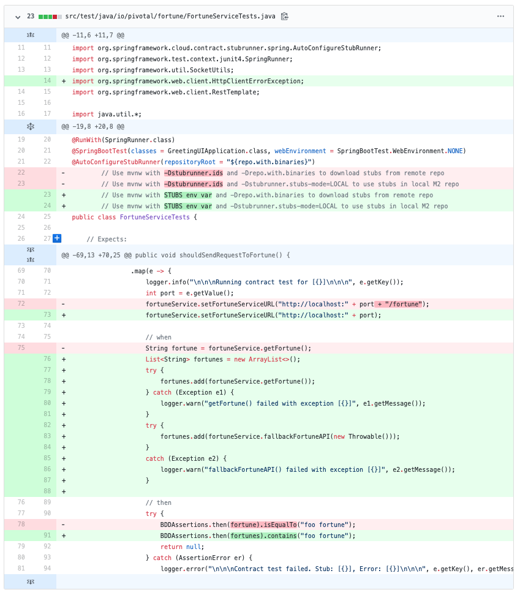
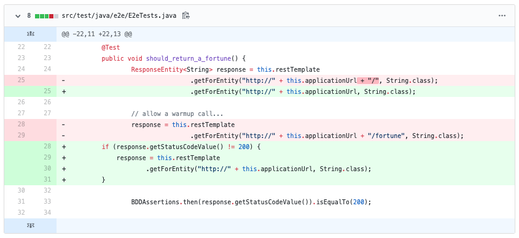

# cna-demo: CI/CD pipeline
This section explains how to set up a CI/CD pipeline for automated deployment of this demo application. (For instructions on how to manually deploy this demo to Pivotal Cloud Foundry, please see the [parent README](../README.md).)

## Introduction
###What

The pipeline in this setup is intended as a reference pipeline that accomplishes the following main objectives:
1. Create a clear distinction between Continuous Integration (CI) and Continuous Delivery (CD)
2. Enable development teams to achieve independent release and rollback cycles of their applications
3. Enable release engineering teams to establish sophisticated deployment pipelines with minimum effort and complexity

###Why

The holy grail in software delivery is fast and frequent deployments. In order to innovate and stay competitive, the ability to deliver product improvements to end users quickly and frequently, and to act on their feedback in order to improve our software, is key. However, coordinated releases of multiple components, manual testing, and complex deployment needs prevent many companies from achieving this objective.

An important aspect of achieving fast and frequent deployments is quality assurance, aka increasing the efficiency and efficacy of testing. A well-known technique for achieving this is Test-Driven Development (TDD).

Another key aspect is enabling independent release and rollback cycles. To achieve this, we must break dependencies between component versions. For this, we must ensure that our code changes are backwards compatible.

A final aspect is achieving sophisticated deployment techniques (e.g. zero-downtime and metrics-driven canary deployments) in a simple way. This requires us to leverage modern toolsets for deployment and runtime.

###How

This demo will focus on the latter two _'why'_ aspects by:
- incorporating back-compatibility testing for APIs and DB schemas into the CI pipeline in order to enable independent release and rollback cycles of applications, and
- leveraging modern tools for deployment and runtime ([Spinnaker](https://www.spinnaker.io) and [OSS](https://run.pivotal.io)/[Pivotal Cloud Foundry](https://pivotal.io/platform), respectively) in order to achieve sophisticated deployment techniques in a simple way

It is worth highlighting that these two aspects go hand-in-hand: in order to take advantage of a zero-downtime (blue/green or canary) deployment capabilities in production, the new code should be back-compatible with the old.

## Instructions, Option 1: Quick & Dirty

This section describes how to execute the crucial back-compatibility tests in this demo on your local machine. It does not require any account or tool setup other than GitHub and the git CLI.

### Pre-requisites
To run this portion of the demo, you will need:
- An account on [GitHub](https://github.com)
- The [git CLI](https://help.github.com/en/articles/set-up-git#setting-up-git) on your local machine


## Instructions, Option 2: Full Setup

### Pre-requisites
To run this demo, you will need:
- An account on [GitHub](https://github.com)
- The [git CLI](https://help.github.com/en/articles/set-up-git#setting-up-git) on your local machine
- Bintray
- Cloud Foundry (free trial at [Pivotal Web Services](https://run.pivotal.io))
- Jenkins
- Spinnaker

### Pre-requisites Setup: GitHub
1. Fork and clone the two demo app repos ([greeting-ui](https://github.com/ciberkleid/greeting-ui) and [fortune-service](https://github.com/ciberkleid/fortune-service)), and check out the `cloud-pipelines-spinnaker` branch in each.
```
mkdir cna-demo
cd cna-demo

git clone https://github.com/YOUR-ORG/fortune-service.git
git checkout cloud-pipelines-spinnaker

git clone https://github.com/YOUR-ORG/greeting-ui.git
git checkout cloud-pipelines-spinnaker
```
2. You will also need to set up SSH access from Jenkins. See the "Jenkins Setup" section below for more information.

### Pre-requisites Setup: Bintray
1. Create an account on Bintray (free). 
2. Bintray requires that a package exist before any application artifacts can be uploaded. Log into the Bintray UI and create the packages for fortune-service and greeting-ui using the option “Import from GitHub.” Refer to these [screenshots](https://cloud.spring.io/spring-cloud-pipelines/single/spring-cloud-pipelines.html#_1_3_create_the_bintray_maven_repository_package) for guidance.
3. Take note of your `<username>/<repo-root>` (`ciberkleid/maven-repo` in the sample screenshot), as you will need this when you set up your Jenkins jobs.
4. Take note of your Bintray API key. You will also need this during your Jenkins setup.

### Pre-requisites Setup: Cloud Foundry
1. Create an Org with four Spaces in it, as follows:
- Org:
    - cloud-pipelines-org
- Spaces:
    - test-fortune-service
    - test-greeting-ui
    - stage
    - prod

### Pre-requisites Setup: Spinnaker
1. Configure Jenkins as a target account within Spinnaker.
    - This is needed so that Spinnaker can create a pipeline trigger based on the build job, and so that it can trigger the stage tests and release tagging jobs
2. Configure Cloud Foundry as a target account within Spinnaker.
    - This is needed so that Spinnaker can deploy the applications to Cloud Foundry
3. You will also need to create a pipeline for each app in Spinnaker. We will come back to this later in these instructions.

### Pre-requisites Setup: Jenkins
1. Create a Credentials object of kind `SSH username with private key`. Create an SSH key pair and copy the private key to the Jenkins credentials object. Add the public SSH key to your GitHub account. This will enable Jenkins to tag releases in the GitHub app repos.
2. Create a Credentials object of kind `secret text` with `value=<your Bintray API key>`. This will enable Jenkins to upload & publish app artifacts to Bintray.
3. You will also need to create several jobs for each app in Jenkins. We will come back to this later in these instructions.    

_____

### Pipeline Setup: Jenkins
You will create a total of six (6) jobs, three for fortune-service, and three for greeting-ui.

To simplify configuration, we are leveraging some of the logic built into the [Cloud Pipelines](https://github.com/cloudpipelines) project. In order to access this code in our Jenkins jobs, each job will download the distribution archive for Cloud Pipelines, which is available on GitHub.

In addition, we are also accessing extensions to the Cloud Pipelines code base in the same way: by downloading a distribution archive from GitHub. The "extensions" code base and distribution archive are part of this repo.

Hence, the only code you need to copy and paste into each Jenkins job is the [bootstrap](./bootstrap.sh) code. Beyond that, there is some simple common configuration for all jobs, and some simple unique configuration for each job.

For all jobs, it is recommended to configure "General->Discard old builds" to limit the "Max # of builds to keep" to avoid filling up the Jenkins disk.

1. **Fortune Service Job: fortune-service-prod-tag-release**
- Create a new job (aka "item") of type "freestyle project" and name it `fortune-service-prod-tag-release`
- Select "General->This project is parameterized" and add the following parameters:

| Parameter      | Default Value | Description |
| ----------- | ----------- | ----------- |
| TRIGGER_BUILD_VERSION   |         |To be set by Spinnaker |
| TRIGGER_COMMIT_ID   |         |To be set by Spinnaker |
| BACK_COMPATIBILITY_DEPTH   |    1     |To be set by Spinnaker |

- Select "Source Code Management->Git" and set:
    - Repository URL: https://github.com/YOUR-ORG/fortune-service.git
    - Credentials: the git ssh credential you created previously
    - Branch Specifier: */cloud-pipelines-spinnaker
- Select "Build->Execute shell" and copy the body of the [bootstrap](./bootstrap.sh) script
    - Update the M2_SETTINGS_REPO_USERNAME and M2_SETTINGS_REPO_ROOT, as appropriate
    - Set jobScript="prod-tag-release.sh"
- Select "Post-build Actions->Git Publisher. Configure as follows:
  - Push Only If Build Succeeds: true (checked)
  - Tags->Tags to push:         prod/fortune-service/${TRIGGER_BUILD_VERSION}
  - Tags->Tag message:          Production release
  - Tags->Create new tag:       true (checked)
  - Tags->Target remote name:   origin
- Select "Post-build Actions->Archive the artifacts" and set:
  Files to archive: ci-build.properties,ci-releases.properties
    
2. **Greeting UI Job: greeting-ui-prod-tag-release**
- Create a new job (aka "item") of type "freestyle project" and name it `greeting-ui-prod-tag-release`
- Select "General->This project is parameterized" and add the following parameters:

| Parameter      | Default Value | Description |
| ----------- | ----------- | ----------- |
| TRIGGER_BUILD_VERSION   |         |To be set by Spinnaker |
| TRIGGER_COMMIT_ID   |         |To be set by Spinnaker |
| BACK_COMPATIBILITY_DEPTH   |    1     |To be set by Spinnaker |

- Select "Source Code Management->Git" and set:
    - Repository URL: https://github.com/YOUR-ORG/greeting-ui.git
    - Credentials: the git ssh credential you created previously
    - Branch Specifier: */cloud-pipelines-spinnaker
- Select "Build->Execute shell" and copy the body of the [bootstrap](./bootstrap.sh) script
    - Update the M2_SETTINGS_REPO_USERNAME and M2_SETTINGS_REPO_ROOT, as appropriate
    - Set jobScript="prod-tag-release.sh"
- Select "Post-build Actions->Git Publisher. Configure as follows:
  - Push Only If Build Succeeds: true (checked)
  - Tags->Tags to push:         prod/greeting-ui/${TRIGGER_BUILD_VERSION}
  - Tags->Tag message:          Production release
  - Tags->Create new tag:       true (checked)
  - Tags->Target remote name:   origin
- Select "Post-build Actions->Archive the artifacts" and set:
  Files to archive: ci-build.properties,ci-releases.properties

3. **Fortune Service Job: fortune-service-stage-e2e**
- Create a new job (aka "item") of type "freestyle project" and name it `fortune-service-stage-e2e`
- Select "General->This project is parameterized" and add the following parameters:

| Parameter      | Default Value | Description |
| ----------- | ----------- | ----------- |
| APPLICATION_URL       |        |   To be set by Spinnaker; sample default value: fortune-service-stage.apps.my-cf-foundation.com     |
| TRIGGER_BUILD_VERSION   |         |To be set by Spinnaker |
| TRIGGER_COMMIT_ID   |         |To be set by Spinnaker |

- Select "Source Code Management->Git" and set:
    - Repository URL: https://github.com/YOUR-ORG/fortune-service.git
    - Branch Specifier: */cloud-pipelines-spinnaker
- Select "Build->Execute shell" and copy the body of the [bootstrap](./bootstrap.sh) script
    - Update the M2_SETTINGS_REPO_USERNAME and M2_SETTINGS_REPO_ROOT, as appropriate
    - Set jobScript="stage-e2e.sh"
- Select "Post-build Actions->Archive the artifacts" and set:
  Files to archive: ci-build.properties
  
4. **Greeting-UI Job: greeting-ui-stage-e2e**
- Create a new job (aka "item") of type "freestyle project" and name it `greeting-ui-build-stage-e2e`
- Select "General->This project is parameterized" and add the following parameters:

| Parameter      | Default Value | Description |
| ----------- | ----------- | ----------- |
| APPLICATION_URL       |        |   To be set by Spinnaker; sample default value: greeting-ui-stage.apps.my-cf-foundation.com     |
| TRIGGER_BUILD_VERSION   |         |To be set by Spinnaker |
| TRIGGER_COMMIT_ID   |         |To be set by Spinnaker |

- Select "Source Code Management->Git" and set:
    - Repository URL: https://github.com/YOUR-ORG/greeting-ui.git
    - Branch Specifier: */cloud-pipelines-spinnaker
- Select "Build->Execute shell" and copy the body of the [bootstrap](./bootstrap.sh) script
    - Update the M2_SETTINGS_REPO_USERNAME and M2_SETTINGS_REPO_ROOT, as appropriate
    - Set jobScript="stage-e2e.sh"
- Select "Post-build Actions->Archive the artifacts" and set:
  Files to archive: ci-build.properties

5. **Fortune Service Job: fortune-service-build-and-upload**
- Create a new job (aka "item") of type "freestyle project" and name it `fortune-service-build-and-upload`
- Select "General->This project is parameterized" and add the following parameters:

| Parameter      | Default Value | Description |
| ----------- | ----------- | ----------- |
| SKIP_BACK_COMPATIBILITY_CHECKS      | false       |        |
| RELEASE_TAGS   |         |Comma-separated list of tags (e.g. prod/fortune-service/1.0.0+20190421.161538Z.a6eba77). If SKIP_BACK_COMPATIBILITY_CHECKS=false and RELEASE_TAGS="", script will dynamically discover latest releases |

- Select "Source Code Management->Git" and set:
    - Repository URL: https://github.com/YOUR-ORG/fortune-service.git
    - Branch Specifier: */cloud-pipelines-spinnaker
- Select "Build environment->Use secret text(s) or file(s)" and set variable M2_SETTINGS_REPO_PASSWORD to the bintray api key (see "Common Setup" section above)
- Select "Build->Copy artifacts from another project" and copy the ci-releases.properties file from job `fortune-service-tag-release`
  This will be used to download the desired fortune-service releases for fortune-service test API and DB schema compatibility
  Set the Target directory to ".git/tools-releases/fortune-service"
- Select "Build->Execute shell" and copy the body of the [bootstrap](./bootstrap.sh) script
    - Update the M2_SETTINGS_REPO_USERNAME and M2_SETTINGS_REPO_ROOT, as appropriate
    - Set jobScript="build-and-upload-fortune-service.sh"
- Select "Post-build Actions->Archive the artifacts" and set:
  Files to archive: ci-build.properties
  
6. **Greeting UI Job: greeting-ui-build-and-upload**
- Create a new job (aka "item") of type "freestyle project" and name it `greeting-ui-build-and-upload`
- Select "General->This project is parameterized" and add the following parameters:

| Parameter      | Default Value | Description |
| ----------- | ----------- | ----------- |
| STUBS      |        |value format: groupid:name:version,groupid2:name2,version2. Sample value: io.pivotal:fortune-service:1-1f7d10d47983699752695c5ddd3274b7620bea35   |

- Select "Source Code Management->Git" and set:
    - Repository URL: https://github.com/YOUR-ORG/greeting-ui.git
    - Branch Specifier: */cloud-pipelines-spinnaker
- Select "Build environment->Use secret text(s) or file(s)" and set variable M2_SETTINGS_REPO_PASSWORD to the bintray api key (see "Common Setup" section above)
- Select "Build->Copy artifacts from another project" and copy the ci-releases.properties file from job `fortune-service-tag-release` (NOT greeting-ui-tag-release!! Both build-and-upload jobs should be getting the `ci-releases.properties` file from the `fortune-service-tag-release` job)
  This will be used to download the desired fortune-service stubs in order for greeting-ui to test API compatibility
  Set the Target directory to ".git/tools-releases/fortune-service"
- Select "Build->Execute shell" and copy the body of the [bootstrap](./bootstrap.sh) script
    - Update the M2_SETTINGS_REPO_USERNAME and M2_SETTINGS_REPO_ROOT, as appropriate
    - Set jobScript="build-and-upload-greeting-ui.sh"
- Select "Post-build Actions->Archive the artifacts" and set:
  Files to archive: ci-build.properties

### Pipeline Setup: Spinnaker
You will create a total of two (2) pipelines, one for fortune-service, and one for greeting-ui.

Details coming soon...

### Demo Code Changes

The following images show the code changes between demo steps.

#### fortune-service 
##### From build-1 (baseline) to build-2 (breaking API change)


##### From build-2 to build-3 (compatible API change)


##### From build-3 to build-4 (breaking DB change)


##### From build-4 to build-5 (compatible DB change)


#### greeting-ui
##### From build-1 (baseline) to build-2 (breaking API change)


##### From build-2 to build-3 (compatible API change)



